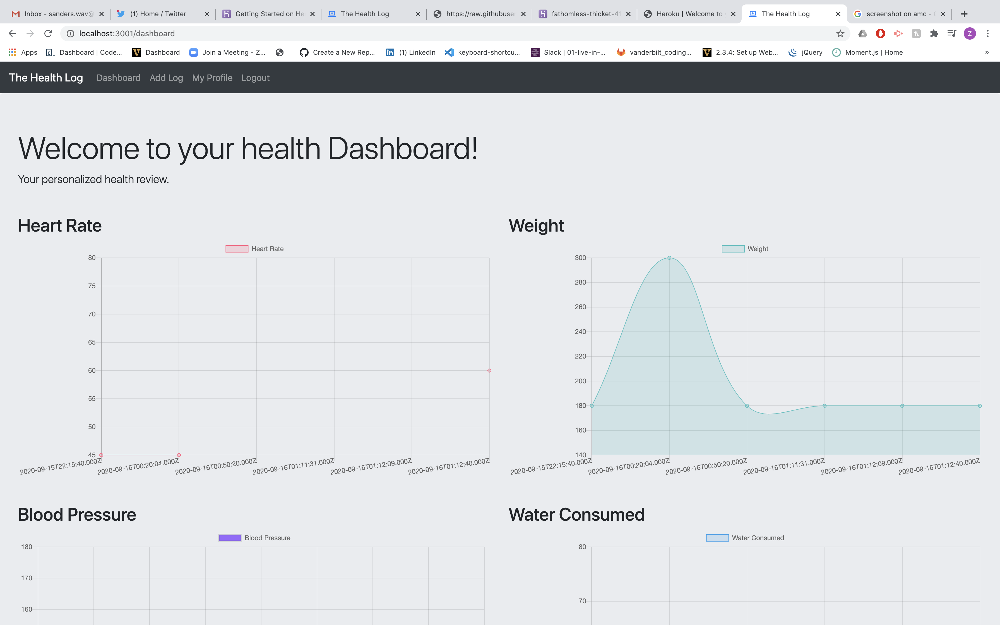
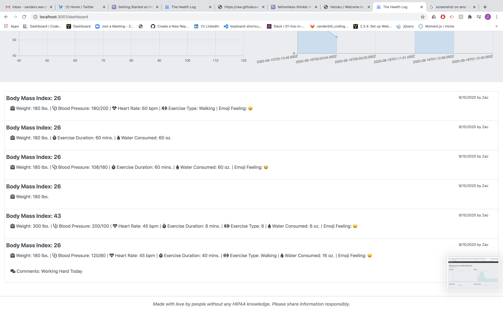

# the-health-log
## Purpose
As a web developer 
I want to create a dynamic health and fitness Restful api that allows for user input and allows for a customizable user experience.
So that users may use the app to improve their overall health..

## Built with
* HTML
* CSS
* Javascript
* Bootstrap
* Jquery
* Express
* Heroku
* Moment.js
* MySql
* Node
* Handlebars
* bcrypt

## Future Changes
We think there are endless oppurtunities for improvement and/or monetezation with this app including adding the ability to get users in contact with Health professionals and personal trainers. Improving overall security would be our primary concern in future updates.

## Website
https://fathomless-thicket-41464.herokuapp.com/

## Screenshot

## Contribution
Developed by Taylor Nyquist, Mike Portnu, Zac Sanders